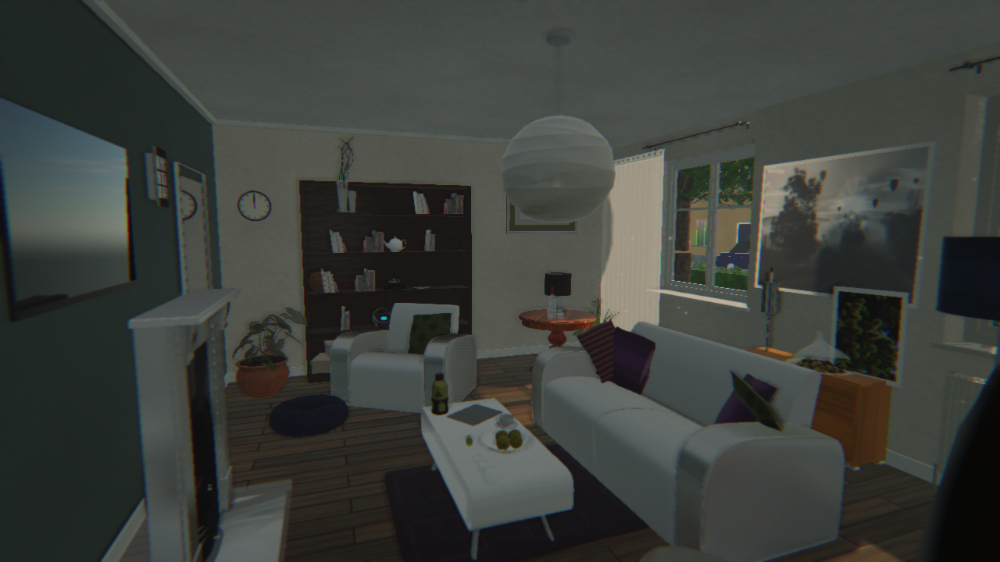
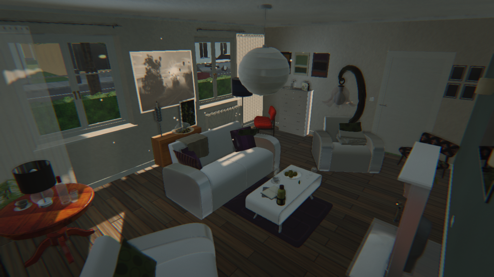
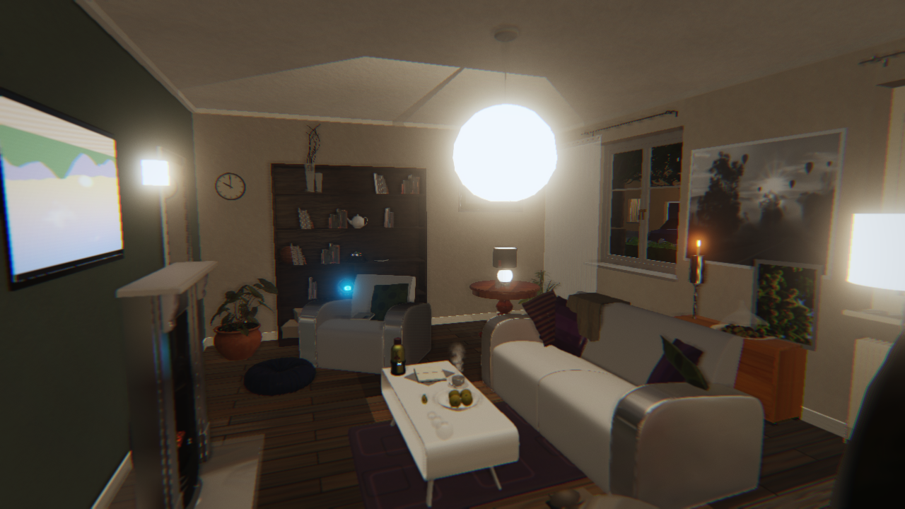
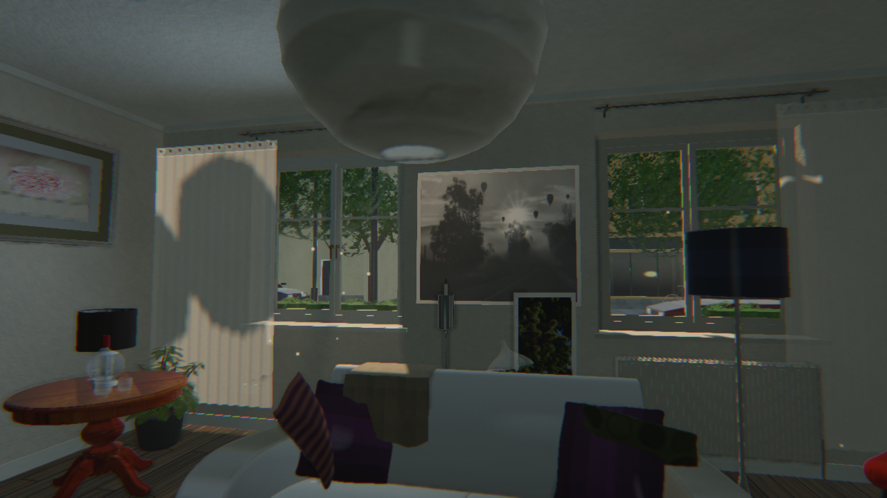
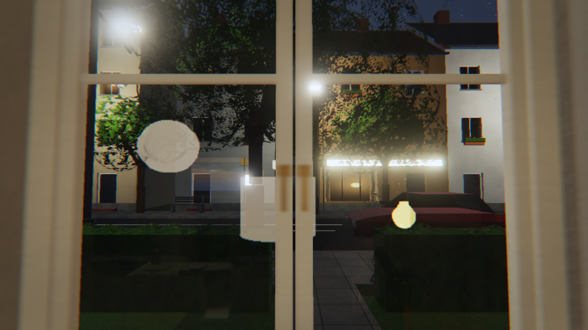
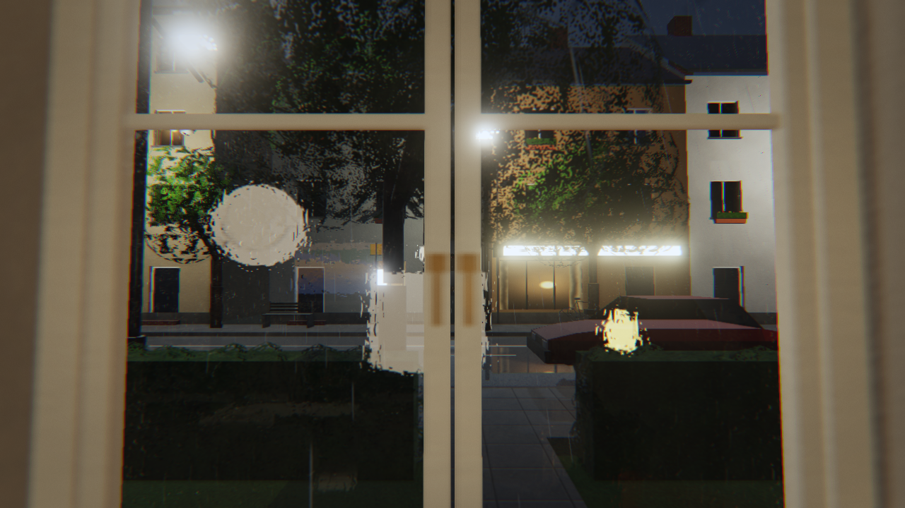
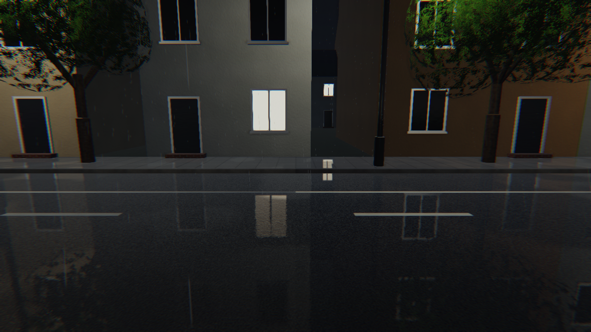
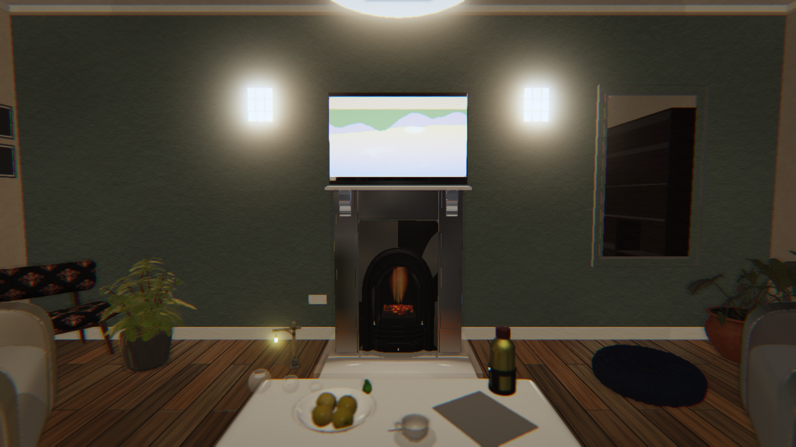

# cna-room

A realistic, explorable 3D living room rendered with [CNA](https://github.com/libcna/cna)
(`next` branch) and [sharp-runtime](https://github.com/libcna/sharp-runtime) (`next` branch),
using CNA's **EasyGL** renderer (`OPENGLES3`) and the **CNAEXT** modern graphics layer.

The application is a free-flying camera inside a furnished residential living room: a slow
continuous day/night cycle, slowly evolving weather seen through the windows, physically based
materials, cascaded shadow maps, image-based lighting, an HDR post-processing chain and real
glTF furniture assets. There is no gameplay; the point is the picture.

> Status: **milestone 9, realism audits** (every earlier milestone landed: furniture, lighting,
> the street outside, day/night, weather, reflections). See `plan.md` for the living plan and
> `NEXT.md` for what happens next.





| Night, lamps on | Midday sun on the sheer, beams in the air | The street in the panes at night |
|---|---|---|
|  |  |  |

| Rain at night: droplets on the panes, the wet street beyond | Out on the pavement: the lit windows in the puddles | A cool evening: the stove lit, the candle burning |
|---|---|---|
|  |  |  |

## Dependencies

cna-room consumes CNA as a sibling checkout with `add_subdirectory()`; CNA in turn expects its
own dependencies beside it:

```
<parent>/
  cna-room/        this repository
  cna/             https://github.com/libcna/cna            branch next
  sharp-runtime/   https://github.com/libcna/sharp-runtime  branch next
  easy-gl/         https://github.com/libcna/easy-gl        branch develop
  meta-gl/         https://github.com/libcna/meta-gl        branch develop
```

`scripts/fetch-dependencies.sh` clones exactly that layout (add `--pin` to check out the
revisions in `dependencies.lock`). CNA builds SDL3, SDL3_image and SDL3_mixer from its vendored
submodules, which on Ubuntu 24.04 need:

```
apt-get install build-essential cmake ninja-build git \
    libxss-dev libxkbcommon-dev wayland-protocols libwayland-dev libdecor-0-dev libdbus-1-dev \
    libudev-dev libibus-1.0-dev libgl1-mesa-dev libegl1-mesa-dev libgles2-mesa-dev libzstd-dev \
    libxrandr-dev libxcursor-dev libxi-dev libxinerama-dev libxfixes-dev libxtst-dev libxt-dev \
    libxv-dev libxxf86vm-dev libpulse-dev libasound2-dev libdrm-dev libgbm-dev
```

## Building

```
cmake -S . -B build -G Ninja -DCMAKE_BUILD_TYPE=Release
cmake --build build --target cna-room
```

`-DCNA_ROOM_RENDERER=OPENGL33` selects the desktop GL 3.3 identity of the same EasyGL renderer.

## Running

```
./build/bin/cna-room                       # windowed, 1280x720
./build/bin/cna-room --width 1920 --height 1080
./build/bin/cna-room --frames 3 --screenshot shot.png   # headless validation
./build/bin/cna-room --view entrance --sun -10,205 --exposure 60 --lamps on --tv on   # evening
./build/bin/cna-room --help                # every option
```

The clock runs by default (one game day in 24 real minutes, starting 14:30); `--time 22:00`
starts at night, `--day-length 2` runs a day in two minutes, `--sun ELEV,AZIM` freezes the sun.

Weather evolves on its own from cloudy; `--weather rain|storm|snow|hail|clear|overcast|cloudy`
starts in a kind, `--hold-weather` keeps it, `--temperature -3` makes rain into snow.

Useful options: `--time HH:MM`, `--day-length MIN`, `--weather KIND`, `--view NAME` (entrance, sofa-to-tv, tv-to-sofa, bookshelf, window, window-close,
material, corner, tv-close, lamp, street, street-left), `--camera x,y,z,yaw,pitch`, `--sun ELEV,AZIM`,
`--clouds COVER[,DENSITY]`, `--haze H`, `--exposure E`, `--lamps on|off|auto`, `--tv on|off|auto`,
`--exposure-mode auto|analytic`, `--texture-size N`, `--shadow-quality 1..4`, `--probe-size N`, `--probe-gain G`, `--ssr`,
`--ssao-radius R --ssao-intensity I --prepass-far F` (the prepass far plane scales CNA's SSAO bias),
`--overlay`, `--dump-probes DIR` (writes each probe bake's captured faces and irradiance as PNG
strips), `--reflection-scale S`, the lens look `--grain G --aberration A --vignette V` (`--clean`
zeroes all three), `--flare I[,T]` (lens flare ghosts, off by default), `--ev STOPS` (exposure compensation
on top of the adapted exposure, ±3), `--sunbeams D[,G,N]` (the air's scattering per metre,
default 0.12, its forward bias and the march's steps; 0 turns the beams off; the march runs at
half size and `--sunbeams-full` marches every pixel), `--no-steam`, `--motes N[,PX]`
(dust motes in the beams, default 400 at 2.5 px), the lens itself `--dof F,MM`
(f-number and focal length, default 4,35),
`--focus D` (metres; the default focuses on the frame's centre) and `--no-dof`, `--white-balance S`
(0 leaves every cast in), `--dump-depth FILE`
(the prepass depth as a grey PNG, the autofocus block marked), `--bloom-intensity I` and
`--bloom-iterations N`, and `--no-shadows
--no-ssao --no-bloom --no-fxaa --no-hdr --no-ibl --no-sky --no-probes --no-reflections` to isolate
a feature.

Without a display (CI, containers) run it under Xvfb with Mesa's software rasteriser:

```
SDL_VIDEODRIVER=x11 LIBGL_ALWAYS_SOFTWARE=1 xvfb-run -a -s "-screen 0 1280x720x24" \
    ./build/bin/cna-room --frames 3 --screenshot shot.png
```

## Controls

| Key | Action |
|---|---|
| W / S | move forward / backward |
| A / D | move left / right |
| Q / E | move down / up |
| Left / Right arrow | turn (yaw) |
| Up / Down arrow | look up / down (pitch) |
| Shift / Ctrl | sprint / precision movement |
| 1 – 8 | jump to a viewpoint, R returns to the start view |
| [ / ] | sun azimuth, - / + sun elevation (Shift: faster) |
| , / . | cloud coverage |
| PageUp / PageDown | clock ±30 minutes; P pauses the clock; Home resets it to 14:30 |
| F2 / F3 | next weather kind / hold the weather |
| L | lamps on/off (manual override; re-captures the interior probes over the next frames) |
| T | television on/off |
| F1 | overlay: clock, weather, exposure, lens and focus, frame and GPU timings, camera |
| F12 | screenshot |
| Esc | quit |

The `[ ] - + , .` keys take the sun and clouds out of the clock's and the weather's hands until
PageUp/PageDown or F2 give them back.

## Graphics features

- HDR (RGBA16F) `RenderPipeline` with ACES tonemapping, image-based auto exposure (a
  centre-weighted, highlight-rejecting meter on a 64 x 36 downsample of the HDR frame) held
  within a band around an analytic schedule, exposure-relative bloom, a photographic lens look
  (fine film grain, a touch of chromatic aberration, a vignette multiplied over the finished
  frame), a thin-lens depth of field (35 mm f/4 by default) with a centre-area autofocus read
  from the prepass depth (a thin obstruction such as a window mullion loses to what stands
  behind it) and pulled like a lens motor, sunbeams (the room's air ray-marched against the
  cascaded shadow atlas, so the light through the windows reads as beams that the mullions
  cut and the street trees dapple, with dust motes drifting where the light reaches), an
  auto white balance that takes most of an overcast
  sky's cast out by day and only part of the lamps' 2700 K at night, FXAA, SSAO from the same
  depth/normal prepass, sorted transparency, daylight height fog, optional SSR; GPU timers per
  pass and an on-screen overlay.
- A television that plays a synthetic programme (landscape, studio, test card) on a render
  target bound as its emissive picture, whose light on the room takes the picture's mean
  colour and level each frame (read back from a 32x18 render of the same programme), a wall
  clock whose hands follow the scene's time, steam rising from the cup on the coffee table
  (a small plume lit by the light at the cup), a knitted throw over the sofa's back, an open
  paperback, the day's post and keys on the chest, and a wood stove that burns on cool
  evenings (embers, flickering flames and their light), with a candle lit alongside the lamps.
- Weather that drifts between clear, cloudy, overcast, rain, storm (lightning), hail and snow:
  rain streaks, flakes and hailstones outside the windows, wet and glossy or snow-covered
  street surfaces (the wet road and pavements mirror the houses, lamps and sky through a
  planar reflection of the street alone, added by their Fresnel share times the wetness and
  gathered into puddles that mirror while the film between them reflects a broken quarter),
  droplets on the panes, curtains stirring in the wind; the direct sun fades with the cloud
  deck (an overcast day is diffuse light with soft, faint shadows).
- A solar clock: sun and moon paths from latitude, date and time; lamps and street lights
  switch at dusk and dawn; exposure adapts to the light; lighting caches (sky IBL, interior
  probes, the pendant's shadow cube) refresh incrementally as the light changes.
- Sun and moon as directional lights from an atmospheric sky model (clouds, stars, moon, twilight,
  haze), three-cascade shadow map, sky IBL products regenerated when the sun moves.
- Three interior environment probes captured from the lit room (half-float), two bounces, giving
  the room its own ambient light and reflections; their irradiance and their prefiltered specular
  (one cube per roughness class) are convolved on the CPU into half-float cubes, so a lamp-lit
  room keeps its colour at night and glossy surfaces reflect it without 8-bit steps.
- Planar reflections for the mirror, the television screen and, at night, the window panes: the
  scene is rendered once more from the camera mirrored in the wall, with the near plane laid onto
  the glass (oblique projection) and the frustum tightened to the glass, and the surfaces look
  their reflection up in that render (the screen through a Fresnel ramp under its picture, the
  mirror as silvered glass, the panes' Fresnel share of the lamp-lit room added over the street,
  bent by the rain droplets' normal map when the panes are wet).
- The windows as light sources by day: a wide spot per window carries the sky's diffuse light
  into the room with distance fall-off, refreshed from the sky each frame, on top of the
  probes' ambient.
- Artificial lights in lumens: pendant, floor lamp, table lamp, two sconces, television; one
  punctual light per object (the most influential), a cube shadow map for the pendant, emissive
  shades and screen.
- A procedural street outside: terraced houses with recessed windows and doors (reveals, sills,
  plinths, gutters and downpipes) whose windows show curtains, lampshades and television glow
  behind their glass (lit at night in warm, dim and cool kinds), neighbours, trees whose
  crowns shade as one volume, clipped hedges with a leafy fringe, street lights, a bench, a
  litter bin and a bicycle leaning on the shop opposite, cars parked along the kerbs, a
  distant skyline; window panes that reflect the room and transmit the street.
- Procedural PBR surfaces (plaster, oak, carpet, weave, paint, concrete, brick, asphalt, grass,
  paving, roof tiles, bark, masked foliage)
  with normal maps and linear-light mip chains; imported glTF materials with per-slot UV
  transforms and rebuilt mip chains.

See `plan.md` §31 for the list of CNA/CNAEXT functionality exercised and §26 for what was found
on the way.

## Assets and licensing

Code is MIT (`LICENSE`). Third-party 3D models keep their own licences (CC0 / CC BY), recorded
per asset in `THIRD_PARTY_ASSETS.md`; they are fetched rather than committed:

```
scripts/fetch-assets.sh      # downloads assets/external/downloads/ and verifies SHA-256
scripts/extract-assets.sh    # Node 18+: extracts per-object GLBs into assets/external/extracted/
scripts/compile-assets.sh    # optional: CNA .cnb per model into assets/cnb/ (loaded in place of the glTF import)
```

Without them the application still runs with the procedural architecture only. Imported model
textures are halved on load above 1024 px (`--model-texture-size N`, 0 keeps them), their mip
chains are rebuilt on the CPU over the cores and shared between parts by content; the load log
lists per model where its time went (about 15 s for the full set on the development VM).

`scripts/capture-views.sh [--quick]` renders the canonical audit set (viewpoints × day, dusk,
night and weather) into `screenshots/audit/` with a contact sheet.

Baked procedural textures are cached as PNG under `assets/cache/textures/` after the first run
(`--texture-cache DIR` moves it, `--texture-cache off` bakes every time).

Credits (CC BY): *The White Room* by Jay-Artist (CC BY 3.0), *The Grey & White Room* by Wig42
(CC BY 3.0), both via Benedikt Bitterli's rendering resources and gkjohnson/3d-demo-data;
Khronos glTF Sample Assets models by Wayfair LLC and Darmstadt Graphics Group GmbH (CC BY 4.0).
CC0: *Bedroom* by SlykDrako, *Little Lamp* by UP3D, Khronos sample models by Microsoft, Wayfair
and the Khronos Group. Architecture, trim and every surface texture are generated procedurally by
this project.

## Known limitations

- Developed and validated on Mesa llvmpipe (no GPU in the development environment): all
  performance figures in `plan.md` are software-rasteriser numbers; a frame at 1280×720 takes
  around a second there and would take a few milliseconds on a GPU.
- CNA bugs and limitations met on the way are catalogued in `CNA_FINDINGS.md` (R-1 … R-35):
  among them one punctual light per draw, 8-bit IBL cubes, no back-face normal flip, no
  alpha-tested shadow casters.
- The exposure is guided by an analytic schedule and a log-average measurement; a view that
  stares into the pendant at night stays bright.
- Weather details not modelled: per-lamp lighting of rain, thunder (no audio), snow on tree
  branches beyond a dusting of the canopy, puddles that grow and dry with the rain (theirs is a
  fixed pattern scaled by the wetness).
- No pedestrians or vehicles outside (no redistributable models reachable from the build
  environment).

## Tests

`ctest --test-dir build` runs CPU-only checks on the solar clock, the weather state machine
(including the diurnal temperature), the procedural texture bakers, the planar reflection
matrices (reflected view, oblique near plane, tightened projection) and the cube-map products
(sampler, irradiance, GGX prefilter) in `tests/`, plus a headless render smoke test
(`tests/render-smoke.sh`: three frames at 320x180 under `xvfb-run`, the screenshot must not be
black; skipped where `xvfb-run` is missing).
