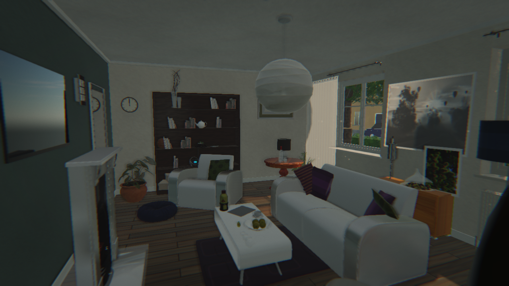

# Living Room Simulator

A C++ reference scene for [CNA](https://github.com/libcna/cna). It renders an explorable living room, changing daylight and weather, and an exterior street. The maintained native baseline is `OPENGLES3` with the revisions in [`dependencies.lock`](dependencies.lock). The application also has a WebGL2 build; its current verification status is in [development notes](docs/DEVELOPMENT.md).



## Get started

On Ubuntu 24.04, install the packages listed in [development notes](docs/DEVELOPMENT.md), then:

```sh
scripts/fetch-dependencies.sh
scripts/fetch-assets.sh
scripts/extract-assets.sh
cmake --preset dev
cmake --build --preset dev
ctest --preset unit
./build-dev/bin/living-room-simulator
```

The first command clones the locked dependencies into ignored `.deps/`. External furniture is also ignored by Git; without the asset commands, the application runs with procedural geometry only. A local development build may take several minutes. `ccache` is optional.

For a deterministic screenshot with a display:

```sh
./build-dev/bin/living-room-simulator --width 640 --height 360 \
  --frames 3 --view entrance --time 12:00 --weather cloudy \
  --hold-weather --screenshot room.png
```

On a headless Linux machine, run that command under `xvfb-run -a` with `SDL_VIDEODRIVER=x11 LIBGL_ALWAYS_SOFTWARE=1`. The complete test suite is `ctest --preset dev`; its render test needs working X11 and Mesa. Use `scripts/capture-views.sh --quick --smoke --bin build-dev/bin/living-room-simulator` to inspect four representative scenes.

## Where to work

| Change | Start here |
|---|---|
| Application options, clock and input | `src/RoomApplication.cpp` |
| Room geometry and object placement | `src/Scene/RoomScene.cpp`, `src/Scene/RoomSceneFurnishings.cpp`, `src/Scene/Exterior.cpp` |
| Lighting, reflections and frame rendering | `src/Render/SceneRenderer.cpp`, `src/Render/SceneRendererProbes.cpp` |
| Postprocessing and shadow effects | `src/Effects/` |
| Model import and texture preparation | `src/Assets/` |
| Time and weather rules | `src/Sim/` |

The [architecture map](docs/ARCHITECTURE.md) explains ownership and data flow. [Development notes](docs/DEVELOPMENT.md) cover builds, assets, WebGL2 and dependency updates. [Visual testing](docs/VISUAL_TESTING.md) describes the reference views; [known issues](docs/KNOWN_ISSUES.md) lists current limitations and cleanup work.

## Repository records

The [original engineering plan](docs/archive/plan.md), [old continuation queue](docs/archive/NEXT.md), [CNA findings](CNA_FINDINGS.md) and [migration report](docs/CNA_MIGRATION.md) record past work. They are evidence and background, not instructions for choosing the next task. [Historical screenshots](docs/archive/README.md) are archived separately from the small gallery above.

Code is MIT licensed. Imported CC BY models include *The White Room* by Jay-Artist and *The Grey & White Room* by Wig42 (CC BY 3.0), plus Khronos sample models by Wayfair and Darmstadt Graphics Group (CC BY 4.0). External models retain their own licences; the full credits, sources and modifications are in [THIRD_PARTY_ASSETS.md](THIRD_PARTY_ASSETS.md). The [repository origin](docs/ORIGIN.md) documents its history.
